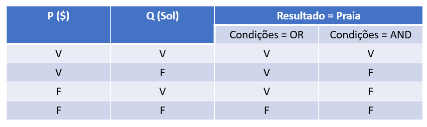

BIBLIOTECA NUMPY - PARTE 1

A Biblioteca Numpy é uma biblioteca da área da Matemática - Álgebra Linear (Matrizes e Vetores)

* Vetores (1 dimensão)
* Matrizes (1 ou mais dimensões)

* Lembrete: Tipos de Matrizes (linha x coluna)

a) Matrizes quadráticas (Ex: 6x6). Esse tipo de matriz apresenta diagonal (o número de elementos da diagonal são sempre a ordem da matriz)

b) Matrizes retangulares (Ex: 4x2)

c) Matriz linha (1xn)

d) Matriz coluna (nx1)

SE A MATRIZ FOR QUADRÁTICA PODE SER: 

e) Matriz triangular inferior ou superior (os valores nulos formam um triangulo inferior ou superior)

f) Matriz diagonal (só os valores da diogonal não são nulos)

g) Matriz identidade (a diagonal principal igual a 1)

h) Matriz simétrica (IMPORTANTE): os valores são distribuídos simetricamente, posicionados igualmente

* OPERAÇÕES ARITMÉTICAS COM MATRIZES

a) Soma e subtração: so se for de mesma dimensão

b) Multiplicação escalar: Todos os indices pelo mesmo número

Ex: 
         5x     [4 2 3]      Resultado: [20 10 15]
                [3 2 1]                 [15 10  5]

c) Produto entre matrizes (AxB)
    * O número de linhas tem que ser igual ao número de colunas
    * O produto não é cumutativo (o resultado de AxB não é igual BxA)
    Ex:
         [2 0]  x  [3 5 1]
         [0 4]     [0 5 2]
         [4 5]
 Resolvendo: 
         (2 x 3 + 0x0); (5x2 + 5x0); (1x2 +2x0)
         ( 0x3 +0x4); (0x5+4x5);(1x0+4x2)
         (4x3+5x0); (4x5+5x5); (1x4+5x2)

Resultado:
        [6  10  2]
        [0  20  8]
        [12 45 14]

d) Matriz Transposta: Inverte colunas e linhas

*Anotações sobre a Tabela Verdade - Exemplo

