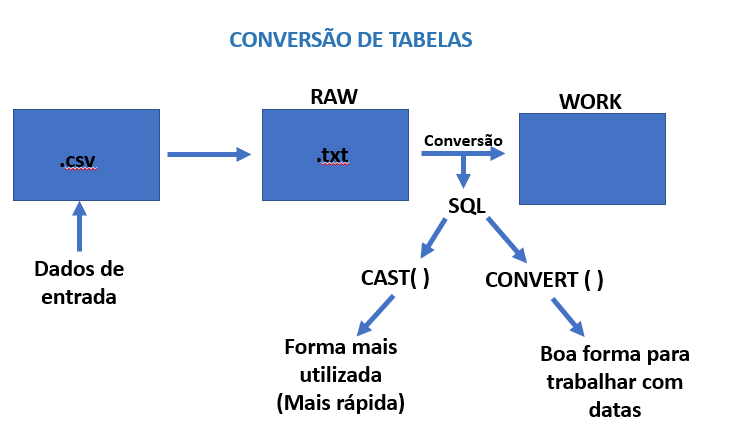
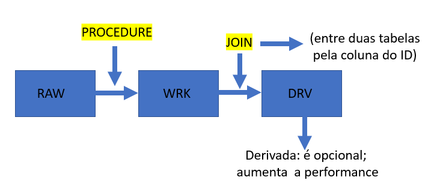
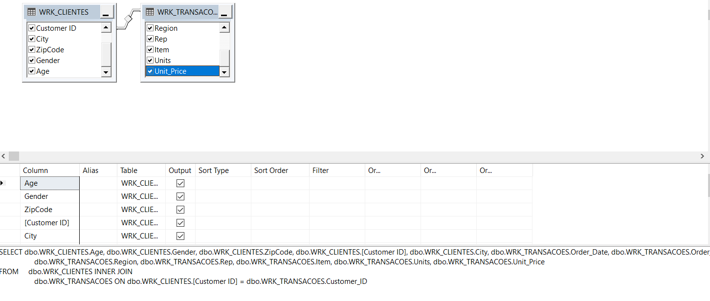
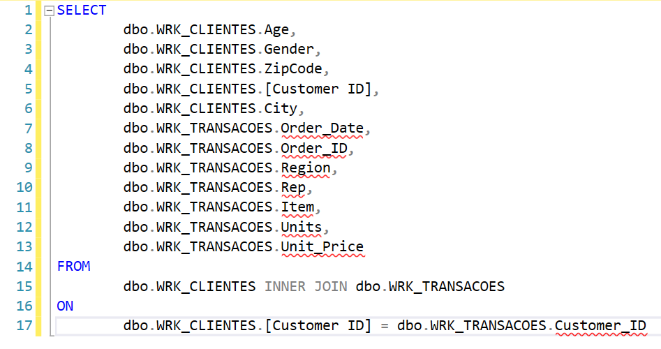

EXTRAÇÃO E PREPARAÇÃO DE DADOS: 

1. Extração e exibição de dados: Passo a passo

a) Instalação da VM Virtualbox

1° SQL Server (Banco de Dados)

2° SSMS - (claint do SQL): utilizado para fazer a conexão com o banco e manipular os dados.

3° VS Comnunity: programação

4° SSDT - (Datat tools): coloca os templates do BI dentro do VS

5° Notepad++: ajuda na "organização" e visualização de arquivo .csv

* Criar um template de pastas para organizar o projeto: Criar uma pasta raíz e dentro dela as pastas para organizar os passos do projeto.
* Pasta raíz: aaaammdd_NomedoProjeto
  1. Dados originais (Nunca modificar)
  2. Dados preparados (Preparação dos dados- organização dos valores, datas, nulos, colunas...)
  3. Dados de upload (Arquivo que está sendo utilizado no SQL)
  4. Análises (códigos e scripts)
  5. Insights
  6. Final

b) Passo a passo de um projeto de Datascience

1. Questões
2. Preparação: aquisição e limpeza de dados: R, Phyton, ETL (Ex: Integration Service) - Fase em que encontra-se problemas, por exemplo, em um formato data. (70% do trabalho do cientista de dados).
3. Exploração
4. Conclusões
5. Comunicação

c) ETL: Extraction, Transform e Load - Extrai o dado, transforma e carrega.
   * Visual Studio 2019: File New project. "Abas" que formam o novo projeto:
   * Server explorer e tollbox: Componentes.
   * Package: workspace - área de trabalho. Control flow (infra) e Dataflow - está dentro do controlflow (Dados)
   * Solution explorer: pacotes
   * Propertiers: Propriedades
   * Conections managers: Conexões

d) PAP para iniciar o projeto
* (Dentro do Visual S) SSIS Tollbox:
  
  arrasta o dataflow para dentro do controlflow)
  e copia o caminho de onde está o dataset
  
* Definindo a origem (Flatfile):
  
   Dataflow - sources - (arrasta o Flatfile source para o dataflow e cola o caminho do dataset - configurar as colunas para texto e comportar até 1000 caracteres). Lembrete: tem que estar no formato cvs.

* Já ocorreu a conexão com o banco (observar na área de conexão) 
  
* Verificando a conexão: 
  conexão - preview - Checar:
   1. Verificar se tem alguma coluna em branco; 
   2.  Observar a última coluna e ver se não tem nenhum dado em branco.
   
* Definindo o destino - Para criar um novo Banco de dados: 
  
   Management Studio SQL Server - Database - New Query - CREATE DATABASE NOMEDOBANCO GO (Comando executar).

   Dentro do Visual Studio: Dataflow - other destinations - ("arrasta") ole DB destination (cria uma conexão com o banco) - (botão direito no conection managers) - New ole DB conection - New - . (Server name - o ponto aponta para a máquina local) - seleciona o database 

   Ligando seta azul: origem ao destino (flatfile ao database). Essa ferramenta trabalha com cash e joga dados em memória também.  

* Criação de tabelas: 
   Dentro do integration: New - name (Raw_nome_data) - O nome nesse formato é uma boa prática, porque controla o versionamento; Raw=cru. [IdCliente] int identity(1,1), - vai "startar" e incrementar de 1 em 1. O erro que aparece no OLEDB diz que tem zero tabelas, então, é necessário criar a tabela e também ir em mappings.

* Para rodar o pacote: 
  
  nomear o pacote; Banco: botão direito, select top 1000; Solution explorer, botão direito em cima do pacote, execute package.

* Botão stop.
  
* Dentro do banco:
   select e execute

O versionamento pode ser feito dentro dos pacotes: clicando com botão direito em packt é possível criar uma nova versão e também desabilitar as versões mais antigas.

2. INFRAESTRUTURA E SEGURANÇA
   
   * Deploy: quando é realizado, os pacotes vão para o servidor e para o catálogo.
  
   * Criação do catálago: (o robô vai agendar os pacotes dentro do catálago) Dentro do Integration Service tem  a pasta catalogs (direito, cria o catálogo): Catálogos são pastas para organizar o desenvolvimento do projeto (pacotes).
  
   * Relatório do pacote: (janela que abre ao executar o pacote: demonstra todos os componentes que rodaram - Quem rodou, duração, qual servidor, é possível ter uma ideia de performance). Todo resumo (em owerview aparece mais detalhado): Botão direito, report, standard report, all executions.
  
   * Automatizando carga de dados (agendamentos de jobs): SQL Server Agent (fica dentro do Integrations service catalogs) - Automatiza jobs (os jobs executam, por exemplo TSQL, SSIS (Integration Service), SSAS (Análise service), Backup, SQL enviar emails). Dentro do jobs, estão os steps (por exemplo: Job 1 - Step 1 backup, step 2 SSIS chama o pacote, Step 3 envia o email, step 4 reindex, ...). Suas abas:  Alerts, operator,  proxis (executor, usuário = segurança), errors log.
   
    * EXECUTANDO O PRIMEIRO JOB: SQL SErvice agent, Jobs, new job (General, steps, New job schedule). JOb activity monitor (monitora os jobs).
  
    * ARQUITETURA DE SEGURANÇA: Projetos que envolvem dados apresentam o cenário: 3 ambientes (3 servidores) - Desenvolvimento (entregáveis - após faz o deploy para o servidor de homologação), homologação (ambiente de teste, após faz o deploy para a produção) e produção. As permissões são diferentes em cada ambiente (configurações e segurança do pacote). 
  
    a) A senha é incriptada no pacote (ou seja, só o criador do pacote, com a senha do windows, consegue acessar)

    b) Painel de controle, administrative tools, computer management, groups, add administrador (nesse caso, as pessoas que precisam do acesso ao pacote podem adicionadas como administrador). 
  
  Para acrescentar um usuário: 

   * (permissão no servidor: roler do servidor) Security, new login, login name, server roler, sysadmin. 
   * User mapping (permissão no Banco): mapeia os databses, os tipos de acessos. 
   * Permissão ao pacote (criptografia de pacotes): proprieties windows, security, protection level, EncryptSensitivyWithUserKey (senha do windows): muda-se para EncryptSensitivyWithPassword (e cria-se a senha para o usuário)
   * Observação: para adicionar o pacote para outro usuário, clica no pacote, SSIS package,  add existing package (não funciona só copiar e colar)  
  
  c) Para colocar um pacote como o objeto de start: clica no pacote, set as startUp object

3. TRATAMENTO DE DADOS
   
   * Abrir o arquivo no Notepad++ (desabilitar a quebra de palavras e habilitar wordwrap - comprime os dados de acordo com a tela) e conferir: procurar por valores, datas (verificar formato dia x mês) salva em análises, 
  
   * Arquivos CSV: (Quando corrompe no excel...) Uma boa prática é copiar o arquivo dentro dos dados preparados - painel de controle - File explore options - View - (e desmarcar): Hide extension for known file file types (esconder extensões de arquivos conhecidos) e transforma o arquivo em .txt
  
   * Organizando a Planilha em excel: (CHECAR COLUNA DE DATAS, CHECAR COLUNA DE VALORES, CHECAR COLUNA DE TEXTO)
  
   a) Abrir o txt dentro do excel - Assitente de texto Etapa 2 - Marcar vírgula (delimitador) e aspas duplas (qualificador) - Etapa 3 - selecionar tudo e marcar como texto (formato de dados)

   b) Coluna de datas: Selecionar - dados - tipos de dados originais (delimitado) - desmarcar delimitadores - Formato MDA (Mês-dia-ano) - seleciona a coluna data: botão direito, formatar célula, personalizado (yyyy-mm-dd)
   
   c) Coluna de valores: selecionar - dados - delimitado - desmarcar delimitadores - formato geral; seleciona a coluna de valores: botão direito, formatar célula, números (negativos e duss casas decimais) 

    d) Coluna feedback (coluna com texto grande): selecionar - dados - delimitado - desmarcar delimitadores - formato geral

    e) Após o arquivo organizado: salvar como arquivo .csv (separado por vírgulas)
   
  4. IDENTIFICANDO ANOMALIAS
   
   * Abrindo o arquivo dentro do SQL, observa-se as anomalias no arquivo. É importante colocar o qualificador ("), que serve paraa para utilizar o delimitador, dentro de uma coluna (por exemplo, uma coluna de feedback, tem muitas palavras e pode ser separado por vírgulas). Outras anomalias podem ser observadas como uma coluna a mais, linhas vazias...
  
   * NOTEPADD++: 
  
   * Identificando anomalias com o SQL: EXEMPLO: 
  
  a) Botão direito na tabela, select top 1000 rows (trás os primeiros 1000 registros)
          SELECT TOP 1000

  b) Todos os registros
         SELECT*

  c) SELECT* (exemplo)
  
      FROM [DS_PROJECTS].[dbo].[RAW_ClientesAfrica_20220311]
      WHERE [Coluna 46] NOT LIKE''
      OR [Longitude] NOT LIKE '%.%'

  Observações:
  
   WHERE '' - onde os registros estão vazios 
   
   OR '%.%' - ou onde qualquer coisa esteja registrada

  5. AUTOMATIZANDO A BUSCA DE ANOMALIAS NO SQL Integrations Service
   
  a) "TRUNCANDO" a tabela (é importante para a tabela não ter registros duplicados): TRUNCATE TABLE

  b) Dentro do Integration: (apaga a conexão entre o ole e o flat) e adiciona no workspace o Conditional split (divide o fluxo de dados), liga ele com o flat file

  c) dentro do conditional split (divisão condicional), coloca-se as condições: 
  
      StringFunctions - LEN (número de caracteres)
  Exemplo: Anomalia

      LEN([column46])>0||LEN([longitude])==0
 
  OBS: ||significa OR e, são os mesmos comandos executados anteriormente em SELECT (registrado acima)

  e) Cria um arquivo simples (flat file) com o nome Anomalias e liga o conditional split nele, configura apontando para a pasta: Análise, erros automáticos
               
6.  CONVERSÃO DE TABELAS

Exercício

Resolvendo o exercício:

Dentro do SQL, importa na DataBase (Ex: DS-projects), botão direito tasks, import data, Source: Flat File Source (encontra o arquivo, determina o qualificador, organiza o string em 1000 caracteres), escolhe o destino: SQL Server native, entra em editar SQL e cria o nome da Tabela RAw - Exemplo: RAW_Transacoes_20221403 e renomeia assim o dbo também. Save como pacote: marca run, marca file sistem (é onde vai salvar), nome do pacote, por exemplo pacote_Transacoes. Feito!!!!

TIPOS DE DADOS X CONVERSÃO: SQL MICROSOFT 

Exemplo: Utilizando CAST (para transformar dados string em float) - Conversão explícita

      SELECT* FROM [dbo].[RAW_Transacoes_220316] 
      ORDER BY CAST ([Unit Price] AS FLOAT)
      GO

Exemplo: Utilizando CONVERT (para transformar dados string em float) 

      SELECT* FROM [dbo].[RAW_Transacoes_220316] 
      ORDER BY CONVERT (FLOAT,[United Price])
      GO

7.  Criando uma procedure para uma tabela WRK (Fase final da preparação de dados) - 

      SP_wRK_CLIENTES.sql e SP_WRK_TRANSACOES.sql

a) Dentro da pasta Database, Programmability, Stored Procedure, New Stored Procedure
 Autor, data, descrição

b) Inserção dos dados - Para fazer um INSERT:
 Clica com o direito na Tabela WRK, script table as, INSERT to, New query window

c) Truncate da tabela (para zerar a quantidade da tabela)

d) Drop Table

   
e) Tratando a coluna ID: Função RIGHT
Exemplo:

      SELECT RIGHT ('0000000' + [Customer_ID],7)

f) Criando tabelas derivadas

Dentro do SQL: View, New View, arrasta as duas tabelas wrk, conecta os ID
 
 
 
 

