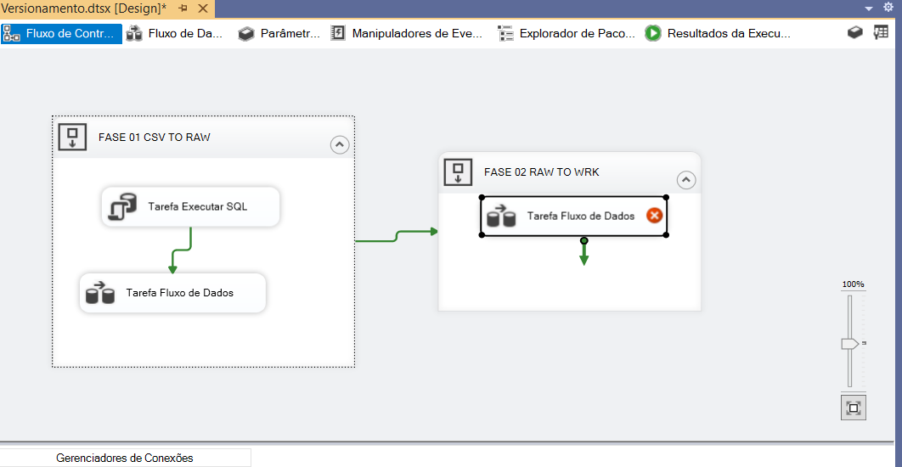
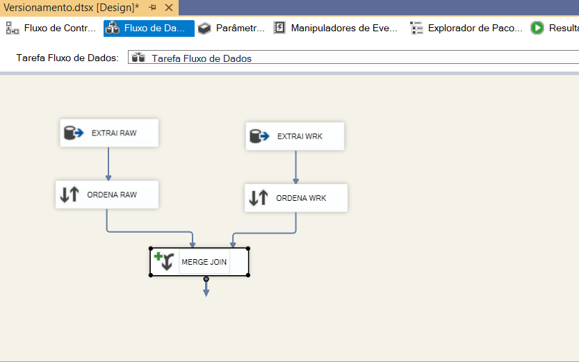
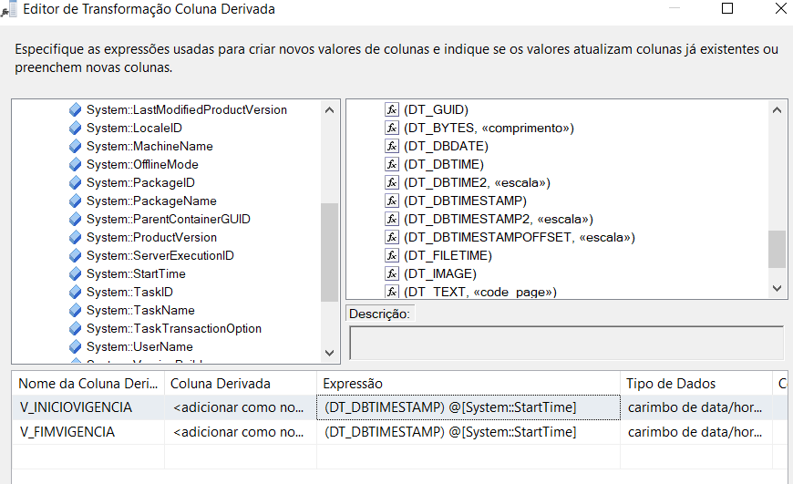
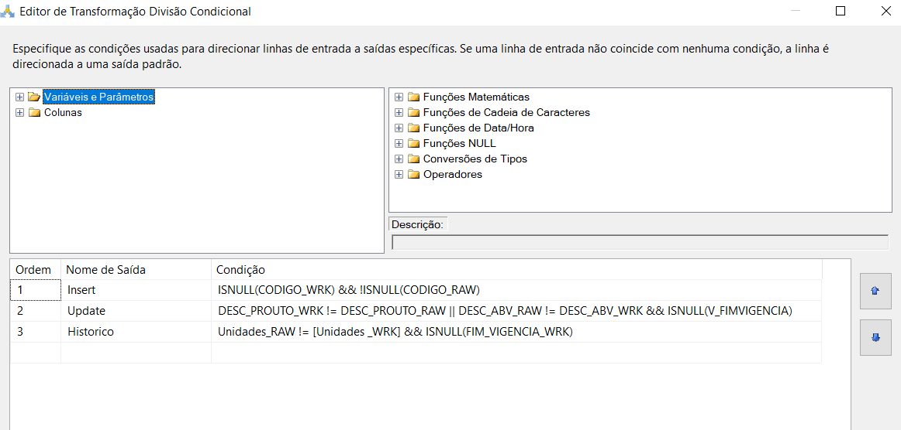
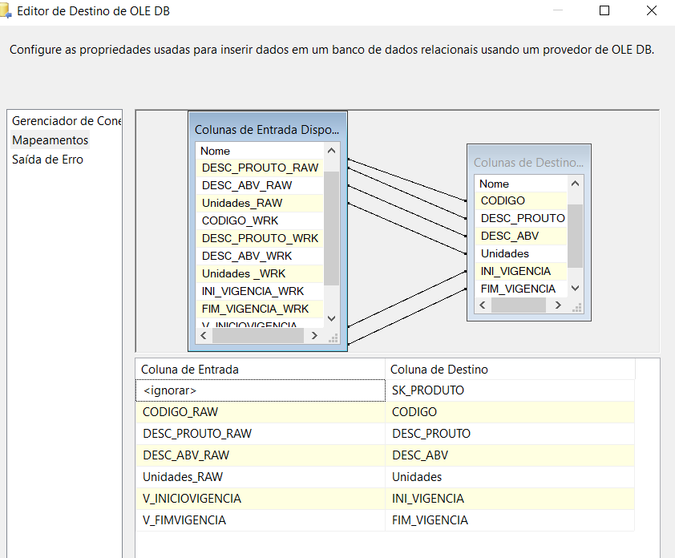

### VERSIONAMENTO DE DADOS - Udemy/Mafra

Sincronizar os dados em CSV com a Tabela WRK (sincroniza o CSV com WRK e utiliza o RAW para comparar com o WRK):

a) *Sequence container (FASE 01 CSV TO RAW)*: Data file source - conecta na fase 2 (se tudo estiver certinhom, truncar a tabela na fase 1: Tarefa executar SQL. Conection. 

SQLstatement: 

    TRUNCATE TABLE RAW_PRODUTOS_ESTOQUE)

Sincronização e versionamento

b) (FASE 02 RAW TO WRK) - Data file source

c) Merge join  (obs: sempre lembrar de colocar RAW e WRK para diferenciar a origem das colunas). Sempre escolher o tipo JOIN LEFT OUTER (JOIN - ESQUERDA)

d) Configuração da tabela derivada (Insert, update, histórico)

e) Conditional Split (Divisão condicional) - 
Insert:

    ISNULL([CODIGO_WRK]) &&! ISNULL([CODIGO_RAW])

Update: 

    [DESC_PROUTO_WRK] != [DESC_PROUTO_RAW] || [DESC_ABV_RAW] != [DESC_ABV_WRK] && ISNULL([V_FIMVIGENCIA])

Historico:

    [Unidades_RAW] != [Unidades _WRK] && ISNULL([FIM_VIGENCIA_WRK])

Comandos:

- Diferente (!=)
- Ou (||)
- e (&&)

f) Registros novos (OLE DB Destination): 

    Fluxo de insert Conditional Split insert OLE DB Destination (Regitros novos)

g) Update simples
Registros novos update OLDE DB Comand (Update simples)